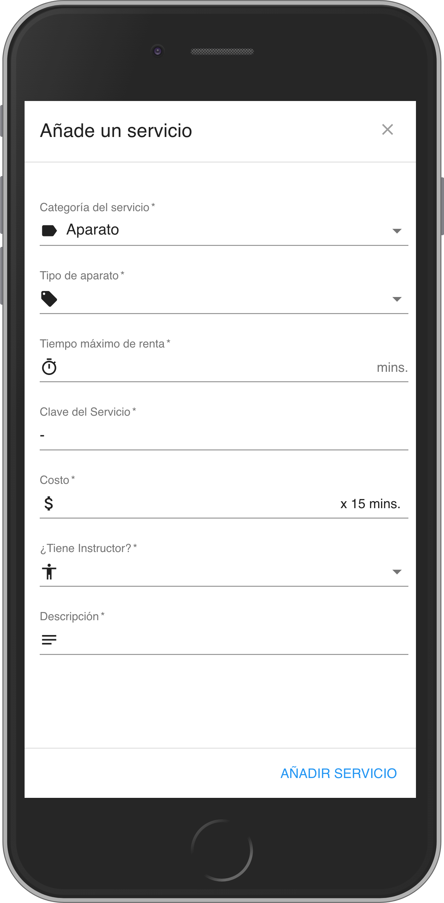

# GYM SERVICES GENERATOR

txt file generator of gym services, according to specifications of a c++ program that records reservations of services.

This app creates the services input file

## How does it works?

Node.JS > 10 required

* `npm install` to install dependecies
* `npm run dev` to start dev environment
* `npm start`to run production environment

## Licended

MIT